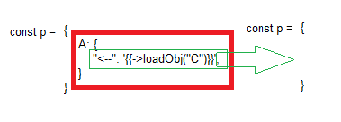

# JS Objects Interpolation - JSOI
[](https://codecov.io/gh/code4ward/JSOI)
<picture>
 
</picture>


## Introduction
In simple terms JSOI is designed specifically for templating javascript objects.  It is
designed to aid in building dynamic and conditional configuration objects while preserving types in output
if possible.  To get a quick feel for what this library offers, you may want to jump directly to the 
[feature matrix](#Feature-matrix), or go through the first example listed in the [The Basics](#The-Basics) section.

<!-- TOC -->
* [JS Objects Interpolation - JSOI](#js-objects-interpolation---jsoi)
  * [Introduction](#introduction)
  * [The Basics](#the-basics)
    * [Example 1](#example-1)
  * [Dependencies](#dependencies)
  * [Building and running unit tests](#building-and-running-unit-tests)
  * [Deploying in your project](#deploying-in-your-project)
    * [Prebuilt javascript](#prebuilt-javascript)
    * [Install with npm](#install-with-npm)
  * [How to use](#how-to-use)
    * [Interface class](#interface-class)
      * [ObjectInterpolator](#objectinterpolator)
        * [Options](#options)
        * [Returns](#returns)
      * [StringInterpolator](#stringinterpolator-)
        * [Returns](#returns-1)
    * [Feature matrix](#feature-matrix)
    * [Simple string interpolation](#simple-string-interpolation)
      * [Example 2](#example-2)
    * [Type Conversions](#type-conversions)
      * [Nested object interpolation](#nested-object-interpolation)
        * [Example 3](#example-3)
      * [Primitive types](#primitive-types)
        * [Example 4](#example-4)
      * [Automatic type conversion](#automatic-type-conversion)
    * [Replacement with simple function calls](#replacement-with-simple-function-calls)
      * [Example 5](#example-5)
    * [Replacement with async function calls](#replacement-with-async-function-calls)
      * [Example 6](#example-6)
    * [Nested function calls](#nested-function-calls)
      * [Example 7](#example-7)
    * [Dynamic variable construction](#dynamic-variable-construction)
      * [Example 8](#example-8)
    * [Local variable override](#local-variable-override)
      * [Object keys may be used as replacement values](#object-keys-may-be-used-as-replacement-values)
        * [Example 9](#example-9)
      * [Declare keys to process and processing order](#declare-keys-to-process-and-processing-order)
        * [Example 10](#example-10)
    * [Conditional loading](#conditional-loading)
      * [Unconditional Loading](#unconditional-loading)
        * [Example 11](#example-11)
      * [Conditional loading load if true](#conditional-loading-load-if-true)
      * [Conditional loading do not load if false](#conditional-loading-do-not-load-if-false)
        * [Example 12](#example-12)
      * [Conditional loading using arrays](#conditional-loading-using-arrays)
        * [Example 13](#example-13)
        * [Example 14](#example-14)
    * [Expression parsing](#expression-parsing)
      * [Supported operators](#supported-operators)
      * [Example 15](#example-15)
    * [Interpolation on function content](#interpolation-on-function-content)
      * [Example 16](#example-16)
    * [Value not found](#value-not-found)
      * [Provide a callback](#provide-a-callback-)
      * [Use a specific predefined behavior](#use-a-specific-predefined-behavior)
    * [Template key as a query string](#template-key-as-a-query-string)
      * [Query string example](#query-string-example-)
  * [Prior Art](#prior-art)
<!-- TOC -->

## The Basics
To interpolate over an object you need to provide at minimum:
1. The object to interpolate over.
2. Embedded tagged replacement keys in the object as strings (denoted by wrapping key with curly braces **{{KEY}}**)
3. A JS object defining your replacement keys

Using the ```ObjectInterpolator``` class you can invoke a simple interpolation over the object as in the example
below:

### Example 1

> In the example below you can see how you can replace variables anywhere in an object.

```javascript
const obj = {
  OuterObject: {
    InnerObject: {
      One: "{{One}}",
    },
    AnotherObject: "{{Obj}}"
  }
}
const oi = new ObjectInterpolator(obj, {
  One: 1,
  Obj: {Test: "A", B: "B"}
}, {})
const rResult = await oi.interpolate();
console.log(obj);
```
***Output***
```text
{
    OuterObject: {
        InnerObject: {
            One: 1,
        },
        AnotherObject: {Test:"A", B: "B"}
    }
}

```
## Dependencies
There are no dependencies within this library on other third party libraries.

## Building and running unit tests
You can build the library which includes linting dist folder will include output library minimized

— **Command**:
```shell
npm run build
```
## Deploying in your project
### Prebuilt javascript
The last build version and instructions on deployment, minimized and non minimized versions can be found here:  [JSOI distribution](https://code4ward.github.io/JSOI/).

### Install with npm
Currently not supported

## How to use
In this section we will describe how to use JSOI, the features available with examples and common use cases.

### Interface class
#### ObjectInterpolator

```javascript
const oi = new ObjectInterpolator({ /* obj: object */}, { /* keyValueContext: object */}, { /* functionContext: object */}, { /* options: object */});
```

To interpolate over an object you simply need to instantiate the ```ObjectInterpolator```, passing in 4 possible 
values:

* The object to interpolate over.
* The key value context to use for replacement values.
* The function context to use for embedded functions.
* The options to use.

##### Options
When constructing the interpolation object you can provide options.  Below is a summary of available options

|   Option Name    | Description                                                                              |                    Default Value                    |                                                                       possible values                                                                        | Example                                                                                             |
|:----------------:|------------------------------------------------------------------------------------------|:---------------------------------------------------:|:------------------------------------------------------------------------------------------------------------------------------------------------------------:|-----------------------------------------------------------------------------------------------------|
|     CopyObj      | When set to true interpolation will be performed over a copy of the provided object.     |                        false                        |                                                                         true\|false                                                                          | const oi = new ObjectInterpolator(obj, { /* ... */ }, { /* ... */}, { CopyObj: true });             |
| KeyValueContextI | Defines the internal interface to use when getting a value from the key value context.   | undefined (internally defaults to KeyValueContextI) | Besides the default value you may also make use of ```QueryObjKeyValueContextI```.  This interface allow you to reference into your object with dot notation | [Refer to the section below for more information](#Template-key-as-a-query-string)                  |


After you have an instance of ```ObjectInterpolator``` you will simply invoke the ```interpolate``` method.   
on the object

##### Returns
```javascript
const { obj, nReplacedKeys} = await oi.interpolate();
```
The returned value will be an object containing the interpolated object (typically the same object you passed in) and
a numeric value indicating how many keys were replaced:


####  StringInterpolator 
To interpolate over a simple string you can create an instance of ```StringInterpolator``` which takes the form:
```javascript
 const si = new StringInterpolator( sTemplate, { /* keyValues :object | KeyValueContextI */ }, { /* options: object */});
```
##### Returns
The return valued is a new string.

### Feature matrix
| Feature                                           | Supported |                      Reference                       |
|---------------------------------------------------|:---------:|:----------------------------------------------------:|
| **Simple Strings**                                |           |                                                      |
| Simple string interpolation                       |    ✔️     |          [1](#Simple-string-interpolation)           |
|                                                   |           |                                                      |
| **Type conversions:**                             |           |                [2](#Type-Conversions)                |
| Primitive type conversion                         |    ✔️     |                [3](#Primitive-types)                 |
| Object type conversion                            |    ✔️     |          [4](#Nested-object-interpolation)           |
| Array type conversion                             |    ✔️     |          [5](#Nested-object-interpolation)           |
| Automatic type conversion                         |    🔻     |           [6](#Automatic-type-conversion)            |
|                                                   |           |                                                      |
| **Core**                                          |           |                                                      |
| Nested object interpolation                       |    ✔️     |          [7](#Nested-object-interpolation)           |
| Replacement with simple function calls            |    ✔️     |     [8](#Replacement-with-simple-function-calls)     |
| Replacement on async function calls               |    ✔️     |     [9](#Replacement-with-async-function-calls)      |
| Nested function calls                             |    ✔️     |             [10](#Nested-function-calls)             |
| Dynamic variable construction                     |    ✔️     |         [11](#Dynamic-variable-construction)         |
| Local variable override                           |    ✔️     |            [12](#local-variable-override)            |
| Object keys may be used as replacement values     |    ✔️     | [13](#Object-keys-may-be-used-as-replacement-values) |
| Declare keys to process and processing order      |    ✔️     | [14](#Declare-keys-to-process-and-processing-order)  |
| Automatically merge and collapse nested arrays    |    ✔️     | [15](#Declare-keys-to-process-and-processing-order)  |
|                                                   |           |                                                      |
| **Conditional loading:**                          |           |              [16](#Conditional-loading)              |
| Conditional loading object - load if true         |    ✔️     |       [17](#Conditional-loading-load-if-true)        |
| Conditional loading object - do not load if false |    ✔️     |   [18](#Conditional-loading-do-not-load-if-false)    |
| Conditional loading using arrays                  |    ✔️     |       [19](#Conditional-loading-using-arrays)        |
| Conditional loading object - load if true         |    ✔️     |       [20](#Conditional-loading-load-if-true)        |
|                                                   |           |                                                      |
| **Special Handling:**                             |           |                                                      |
| Expression parsing                                |    ✔️     |              [21](#Expression-parsing)               |
| Interpolation on function content                 |    🔻     |       [22](#Interpolation-on-function-content)       |
| Value not found                                   |    ✔️     |                [23](#Value-not-found)                |
| Using template key as a query string              |    ✔️     |                                                      |


### Simple string interpolation
You can do simple string interpolation with the ```StringInterpolator``` class.  The example below covers this case

#### Example 2
> In the example below a simple string is interpolated with the ```StringInterpolator``` class. 
```javascript
const si = new StringInterpolator("Hello {{HOW}} {{ARE}} {{YOU}}?", {
    ARE: "are",
    YOU: "you"
},{ ReplaceNotFoundHandler: (templateVar, key) => { return ''; }});
const name = await si.sInterpolate();
console.log(name);
```

***Output***
```text
"Hello  are you?"
```

**Note:** If you need to track curley braces, you will need to pass in the option
```{TrackCurlyBrackets: true}```

### Type Conversions
JSOI attempts to maintain types of replacement parameters.  This is possible in most cases as long as your parameterized 
string only contains one replacement variable.  For example a string replacing a single type may be converted as in:

```Numbers: "{{Number1}}"```

In this case, after interpolation, you might expect the previous string to resolve to:

```Numbers: 1```  

However, in a multivariable replace, type conversion is obviously not possible as in:

```Numbers: "{{Number1}} {{Number2}} {{Number3}}"```

Potentially resolving down to:

```Numbers: "1 2 3"```

#### Nested object interpolation
As already demonstrated in [Example 1](#The-Basics), replacement parameters may be deeply nested in the
object template.  In addition to this, arrays may also contain template variables as shown in the example below:


##### Example 3
> Below is another nested object example, interpolation is done over the whole object.

```javascript
const obj = {
  OuterObject: {
    InnerObject: {
      One: "{{One}}",
    },
    AnotherObject: "{{A}}",
    Array: ["{{Obj1}}", "{{Obj2}}", "{{Obj3}}"]
  }
}
const oi = new ObjectInterpolator(obj, {
  One: 1,
  A: {Test: "A", B: "B"},
  Obj1: {obj1: "1"},
  Obj2: {obj2: "2"},
  Obj3: {obj3: "3"}
}, {})
const rResult = await oi.interpolate();
console.log(obj);
```

***Output***
```text
{
    OuterObject: {
        InnerObject: {
            One: 1
        },
        AnotherObject: {Test:"A", B: "B"},
        Array: [{obj1:"1"}, {obj2:"2"}, {obj3:"3"}]
    }
}
```

#### Primitive types
JSOI supports type conversion on most javascript primitive types (except ```undefined```).  Support,
for basic object and array replacement is also supported.

##### Example 4
> Notice in this example how types are preserved.

```javascript
    const obj = {
  One: "{{One}}",
  Two: "{{Two}}",
  Three: "{{Three}}",
  String: "{{String}}",
  Number: "{{Number}}",
  Bool: "{{Bool}}",
  Null: "{{Null}}",
  Array: "{{Array}}",
  Obj: "{{Obj}}"
}
const oi = new ObjectInterpolator(obj, {
  One: 1,
  Two: 2,
  Three: 3,
  String: "this is a simple string",
  Number: 43,
  Bool: true,
  Null: null,
  Array: ['1', '2', '3', '4', 5, 6],
  Obj: {Test: "A", B: "B"}
}, {})
const rResult = await oi.interpolate();
if (rResult.nReplacedKeys === 9)
  console.log(obj)
```
***Output:***
```text
{
    One: 1,
    Two: 2,
    Three: 3,
    String: "this is a simple string",
    Number: 43,
    Bool: true,
    Null: null,
    Array: ['1', '2', '3', '4', 5, 6],
    Obj: {Test: "A", B: "B"}
}
```

#### Automatic type conversion
Since JSOI allows multiple replacements within one key value pair, it might seem possible that it would also do automatic 
type conversion.  This is currently not supported, consider for example:

```Numbers: "{{{{Number1}}{{Number2}}{{Number3}}}}"```

In the case where all replacement values were numbers the result of the replacement operation on the above string might 
be:

```Numbers: "123"``` as opposed to  ~~```Numbers: 123```~~

This is not to say you cannot define a function to do your type conversion (see [the next section](#Replacement-with-simple-function-calls)
for more information on defining your own functions).

### Replacement with simple function calls
In some cases it is convenient to replace values via a function call, this can be achieved by passing a function
context as a separate parameter into: ```ObjectInterpolator```.  The function call is denoted by the ```->``` 
symbol, followed by the function name ```->functionName```, and any function parameters as in: 
```->functionName(param1, param2, paramN-1, paramsN)```.  

This whole function call must also be wrapped in curly braces as in:

```{{->functionName(param1, param2, paramN-1, paramsN)}}```

Of course parameters to the function may also be replaceable parameters.  The example below illustrates these concepts.   


#### Example 5
> User defined functions provide the ability to extend JSOI and parameters can be interpolated.

```javascript
const parseFContext = {
  concatString: (sender, a, b) => a.concat(b),
};
const obj = {
  Value: "{{->concatString  (  '{{First}}', '{{Second}}'  )}}",
};
const oi = new ObjectInterpolator(obj, {
  First: "ABC,",
  Second: "DEF"
}, parseFContext);
const rResult = await oi.interpolate();
console.log(obj);
```
***Output:***
```text
{
    Value: "ABC,DEF",
}
```
**NOTE:**  You may notice that white space is ignored within and around the function call and also string parameters 
should be quoted to ensure whitespace separation.

### Replacement with async function calls
Following the same function format as above, replacement functions may also be asynchronous.  Multiple replacements on the same 
key value pair will be performed in parallel.  Replacements over multiple key value pairs are performed synchronously.  

Consider the example below, the first two "simulateFetch" (FirstName and LastName) calls are processed in parallel, when this
one completes, the next two are processed in parallel (HouseNo and Street).

#### Example 6
> In this demonstration an object is constructed via asynchronous function calls.

```javascript
const wait = ms => new Promise((r, j) => setTimeout(r, ms));
const data = {
  FirstName: "John",
  LastName: "Doe",
  HouseNo: "4",
  Street: "Wayward Pines",
};
const parseFContext = {
  simulateFetch: async (sender, addr) => {
    await wait(1000);
    return data[addr.Key];
  },
};

const obj = {
  FullName: "{{->simulateFetch({{FirstName}})}} {{->simulateFetch({{LastName}})}}",
  Address: "{{->simulateFetch({{HouseNo}})}} {{->simulateFetch({{Street}})}}",
};
const oi = new ObjectInterpolator(obj, {
  FirstName: {Address: "http://localhost:8000/", Verb: "GET", Key: "FirstName"},
  LastName: {Address: "http://localhost:8000/", Verb: "GET", Key: "LastName"},
  HouseNo: {Address: "http://localhost:8000/", Verb: "GET", Key: "HouseNo"},
  Street: {Address: "http://localhost:8000/", Verb: "GET", Key: "Street"},
}, parseFContext);
const rResult = await oi.interpolate();

console.log(obj);
```
***Output:***
```text
{
  "FullName": "John Doe",
  "Address": "4 Wayward Pines"
}
```
### Nested function calls
JSOI supports nested function calls, consider the example below.

#### Example 7
> In the example below you can see how parameters to user defined functions may be deeply nested.

```javascript

const parseFContext = {
  add: (sender, a, b) => a + b,
  mul: (sender, x, y) => x * y,
  sub: (sender, a, b) => a - b,
  div: (sender, a, b) => a / b
};
const obj = {
  Value: "{{->add(mul(sub(1,2),3),div(4,5))}}",
}
const oi = new ObjectInterpolator(obj, {}, parseFContext);
const rResult = await oi.interpolate();
console.log(obj);
```
***Output:***
```text
{
    Value: -2.2
}
```

### Dynamic variable construction
Nesting variables allow for dynamic variable construction.  In the example below two possible variables
may be constructed, based on the value of TestNumber.

#### Example 8
> Replace variables dynamically constructed.

```javascript
const obj = {Test: "{{RunTest-{{TestNumber}}}}"}
const oi = new ObjectInterpolator(obj, {
  "RunTest-1": "Run1stTests",
  "RunTest-2": "Run2ndTests",
  TestNumber: 2
}, {});
const rResult = await oi.interpolate();
console.log(obj);
```
***Output:***
```text
{
    Test: "Run2ndTests",
}
```

### Local variable override
Variable value may be extracted from either the passed in variable context or from the object itself.
For Example consider the case where your interpolation obj looks like this:
```javascript
    const obj = { UseLocalVar: 1, Test: "{{UseLocalVar}}" }
```
Regardless of what your variable context looks like, you will arrive at the following output, since
UseLocalVar exists in the object and will be used.  
```javascript
    const obj = { UseLocalVar: 1, Test: 1 }
```
**NOTE:**  In some cases of local variable use, key order may be important.  If there is a dependency on kv pairs being 
fully rendered, before use, consider formally declaring processing order on keys (see [next section](#Declare-keys-and-key-processing-order))

#### Object keys may be used as replacement values
JSOI, processes replacement params in order of key iteration.  This has the unintended consequence of creating a dependency 
on key order in the replacement object.  There are two approaches to dealing with key order, the first is to interpolate in 
a loop the second is to provide the order in which you would like to process the object keys (see [Declare keys to process and processing order](#Declare-keys-to-process-and-processing-order).
The example below highlights how to interpolate in a loop where there is a dependency order on object keys.  Keep in mind,
you will only care about this and the next section, if your keys, in your replacement object have a dependency on another 
replacement key, in the object you are interpolating over.  Keep in mind also, there are two sources of replacement values:  
1.  The replacement object itself (local variable override).
2.  The keyValue params object (primary source).


##### Example 9
In the example below, notice the dependancy order problem on the first two keys:
1. Before ```AllNumbersAndSomethingAndNothing``` can be resolved ```AllNumbersAndSomething``` must be resolved.  We must process,
```AllNumbersAndSomething``` first.  
2. ```AllNumbersAndSomething``` cannot be fully resolved until ```AllNumbers``` is resolved, therefore ```AllNumbers``` should be
processed first.

The example below shows you how to loop until all keys are resolved.  Note, as we already mentioned you may specify the keyorder
and avoid looping if you like.

```javascript
const obj = {
    AllNumbersAndSomethingAndNothing: "{{AllNumbersAndSomething}} and {{Nothing}}",
    AllNumbersAndSomething: "{{AllNumbers}} and {{Something}}",
    AllNumbers: "{{ FirstN }} {{SecondN}} {{ThirdN}}",
    NoMatch: "{{NoMatch}}",
};
const oi = new ObjectInterpolator(obj, {
    FirstN: 1,
    SecondN: 2,
    ThirdN: 3,
    Something: "Something",
    Nothing: "Nothing",
}, {});


let nReplacedKeys = 0;
let nIterations = 0;
do {
    nReplacedKeys = (await oi.interpolate()).nReplacedKeys;
    nIterations++;
} while(nReplacedKeys > 0);
expect(nIterations).toBe(4);
expect(obj).toMatchObject({
    AllNumbers: "1 2 3",
    AllNumbersAndSomething: "1 2 3 and Something",
    AllNumbersAndSomethingAndNothing: "1 2 3 and Something and Nothing",
    NoMatch: "{{NoMatch}}",
});

```


#### Declare keys to process and processing order
To ensure only certain keys are processed and to enforce a processing order you can add the ```__ProcessKeys__``` 
array to indicate which keys should be processed and the order of processing.

The example below ensure that ```UseTest1``` is fully rendered before processing ```UseTest2```.  In 
this case, this is important since processing in normal order would leave UseTest2 un-rendered, due to
the dependency on ```UseTest1```.  

##### Example 10
> An example of choosing the order of key processing.

```javascript
const obj = {
  UseTest2: "{{UseTest1}}",
  UseTest1: "{{Test1}}",
  __ProcessKeys__: ["UseTest1", "UseTest2"]
}
const oi = new ObjectInterpolator(obj, {
  "Test1": "Run1stTests",
  "UseTest2": "Run2ndTests",
  TestNumber: 2
}, {});
const rResult = await oi.interpolate();
console.log(obj);
```
***Output:***
```text
{
  "UseTest2": "Run1stTests",
  "UseTest1": "Run1stTests",
  "__ProcessKeys__": [ "UseTest1", "UseTest2"]
}
```

### Conditional loading
Conditional loading allows you to load a child object into a parent object, within your template, if a condition is met.
Although this functionality may seem arbitrary on the surface, it turns out it is extremely useful.  Consider a case 
where you need to assemble a configuration object from multiple sources. 

**NOTE**:  Interpolating loaded content is left for the user (see [below](#Interpolation-on-function-content)) 

The command to invoke this operation is placed within the object key and is denoted by the symbol:
```
<--
```

There are a few forms of conditional loading:
1. Unconditional Loading: ```{'<--': '{{ValueToLoad}}'}```
2. Positive (load object): ```{'<--true': '{{ValueToLoad}}'}```
3. Negative (do not load object): ```{'<--false': '{{ValueToLoad}}'}```

Generally speaking the goal of conditional loading is to load a child object into its parent and remove the child object
if the remaining object is empty.  The graphic below should help highlight the point:

<p align="center"> </p>

From the image above, you can see the object "p" contains another object "A".  The object "A" has the load directive set on 
its key.  When the load completes the content (red box), is replaced with the loaded content.
 

#### Unconditional Loading
In the example below we see the root object containing another object "A".  This object contains only one key value pair 
and the key of this object is set to the unconditional loading directive.

**NOTE:** The process of loading the data into the parent will force the deletion of the child object if the child object
becomes empty due to the load operation.  

##### Example 11
> An example of loading data into a parent object.

```javascript
const obj = {
  A: {
    "<--": '{{->loadObj("C")}}',
  }
};

const oi = new ObjectInterpolator(obj, {}, {
  loadObj: async (sender, key) => {
    return {[key]: `This is a key: ${key}`};
  }
});
await oi.interpolate();

console.log(obj);
```
***Output:***
```text
{
    C: "This is a key: C",
}
```

#### Conditional loading load if true
In the simplest case of conditional loading (true case), you have a key that take the following form:

```"<--true": 'value'```

In practice, however, the boolean true value would normally be parameterized, for example:

```"<--{{TrueValue}}": 'value'```


#### Conditional loading do not load if false
In the simplest case of conditional loading (false case), you have a key that take the following form:

```"<--false": 'value'```

Exactly like the previous true case, the false value may be parameterized 

```"<--{{FalseValue}}": 'value'```
 
##### Example 12
> An example of conditionally loading data into a parent object.

```javascript
const obj = {
  A: {
    "<--{{LA}}": '{{->loadObj("A")}}',
    "<--{{LB}}": '{{->loadObj("B")}}',
    "<--{{LC}}": '{{->loadObj("C")}}',
  }
};

const oi = new ObjectInterpolator(obj, {
          LA: true,
          LB: false,
          LC: true,
        },
        {
          loadObj: async (sender, key) => {
            return {[key]: `This is a key: ${key}`};
          }
        }
);

await oi.interpolate();
console.log(obj);
```
***Output:***
```text
{
    A: "This is a key: A",
    C: "This is a key: C",
}
```

#### Conditional loading using arrays
In the previous example we made use of loading child objects into parent objects.  Generally the same rules apply to
arrays.  However, with arrays, when collapsing child object into it's parent the child array is merged into the 
parent array at index.

##### Example 13
> An example of loading data into an array element, notice how the added a array is merged in place.

```javascript
const obj = [
  {
    NestedArray: [1, 2, {"<--": '{{->loadObj(3)}}'}, 6, 7, 8],
  },
];
const oi = new ObjectInterpolator(obj, {}, {
  loadObj: async (sender, n) => {
    return [n, n + 1, n + 2];
  }
});

await oi.interpolate();
console.log(obj);
```

***Output:***
```text
[
    {
        NestedArray: [1, 2, 3, 4, 5, 6, 7, 8]
    }
]
```

##### Example 14
> In the example below multiple array objects are loaded.

```javascript
const obj = [
  {
    Obj: '{{->loadObj({{FirstN}})}}'
  },
  {
    Obj: '{{->loadObj({{SecondN}})}}'
  }
]
const oi = new ObjectInterpolator(obj, {
  FirstN: 10,
  SecondN: 11
}, {
  loadObj: (sender, n) => {
    return {A: n, B: "2", C: {D: "Yes"}};
  }
});

const rResult = await oi.interpolate();

console.log(obj);
```
***Output:***
```text
[
    {
        Obj: {A:10, B:"2", C:{D:"Yes"}}
    },
    {
        Obj: {A:11, B:"2", C:{D:"Yes"}}
    }
]
```
### Expression parsing
JSOI supports expression parsing allowing for combining basic mathematical and logical expressions together with ternary
conditions.  To invoke the expression parser, you should use one of the builtin expression functions.  There are currently
two forms of the function, short and long:

1. ->Exp('1+2')
2. ->ƒ('1+2')

#### Supported operators
The table below list currently supported operators within the expression parsing feature.

| Symbol  | Description              |              Form                                       |                   Example                   |              Output               |
|:-------:|--------------------------|:-------------------------------------------------------:|:-------------------------------------------:|:---------------------------------:|
|   ?:    | Ternary conditional      | (*condition*) ? <br/>(*true branch*) : (*false branch*) | ->ƒ( '**(1 == 1) ? (2 * 5.1) : (4 / 3)**' ) | $$\color{green}{\text{ 10.2 }}$$  |
|  +, -   | Additive, subtractive    |                          a + b                          |         ->ƒ( '**10.5 + -2 - 4**' )          |  $$\color{green}{\text{ 4.5 }}$$  |
|  *, \/  | Multiplicative, Divisive |                          a * b                          |          ->ƒ( '**(1 / 4) * 4**' )           |   $$\color{green}{\text{ 1 }}$$   |
| ==, !=  | Relational: = and ≠      |                         a == b                          |       ->ƒ( '**((1 / 4) * 4) == 4**' )       | $$\color{green}{\text{ false }}$$ |
| \>=, <= | Relational: ≥ and ≤      |                         a >= b                          |       ->ƒ( '**((1 / 4) * 4) >= 4**' )       | $$\color{green}{\text{ false }}$$ |
|  \>,<   | Relational: > and <      |                          a > b                          |       ->ƒ( '**((1 / 4) * 4) < 4**' )        | $$\color{green}{\text{ true }}$$  |
|    !    | Logical not              |                          !(a)                           |     ->ƒ( '**!(((1 / 4) * 4) == 4)**' )      | $$\color{green}{\text{ true }}$$  |
|   &&    | logical AND              |                         a && b                          |      ->ƒ( '**(1 == 2) && (1 == 1)**' )      | $$\color{green}{\text{ false }}$$ |
|  \|\|   | Logical Or               |                        a \|\| b                         |     ->ƒ( '**(1 == 2) \|\| (1 == 1)**' )     | $$\color{green}{\text{ true }}$$  | 

**NOTE:** Ternary conditional takes the form ```() ? () : ()``` brackets should be provided in complex statements to ensure
proper parsing.

#### Example 15
> Combining all expression examples above, the example below parameterizes the number 1.

```javascript
const obj = {
  A: "{{ ->ƒ( '({{One}} == {{One}}) ? (2 * 5.{{One}}) : (4 / 3)' ) }}",
  B: "{{ ->ƒ( '10.5 + -2 - 4' ) }}",
  C: "{{ ->ƒ( '({{One}} / 4) * 4' ) }}",
  D: "{{ ->ƒ( '(({{One}} / 4) * 4) == 4' ) }}",
  E: "{{ ->ƒ( '(({{One}} / 4) * 4) >= 4' ) }}",
  F: "{{ ->ƒ( '(({{One}} / 4) * 4) < 4' ) }}",
  G: "{{ ->ƒ( '!((({{One}} / 4) * 4) == 4)' ) }}",
  H: "{{ ->ƒ( '({{One}} == 2) && ({{One}} == {{One}})' ) }}",
  I: "{{ ->ƒ( '({{One}} == 2) || ({{One}} == {{One}})' ) }}",
};

const oi = new ObjectInterpolator(obj, {
  One: 1
}, {});

await oi.interpolate();
console.log(obj);
```
***Output:***
```text
{
  "A": 10.2,
  "B": 4.5,
  "C": 1,
  "D": false,
  "E": false,
  "F": true,
  "G": true,
  "H": false,
  "I": true
}
```

### Interpolation on function content
This is currently not directly supported, at this point it is left for the user to implement.  However, it is trivial to 
implement within the function context.  The example below highlights the solution.  When our custom function, ```loadObj```, 
gets called, the function has an object to return, but it first must be evaluated against the existing key value context 
(something not currently directly supported).  The solution is simply to get the current key value context and invoke 
an interpolation with this against our object.

#### Example 16
> An example of how you might interpolate over data before being returned by your function.

```javascript
const obj = [
  {
    "<--true": '{{->loadObj()}}'
  }
];

const oi = new ObjectInterpolator(obj, {Name: "ConfigName1"}, {
  loadObj: async (sender) => {
    const loadedObj = {
      ConfigName: "{{Name}}"
    };
    (new ObjectInterpolator(loadedObj, sender.getKeyValueContext())).interpolate();
    return loadedObj
  }
});

await oi.interpolate();
console.log(obj);
```
***Output:***
```text
[
    { Name: "ConfigName1" }
]
```
### Value not found
In some cases your tagged value (```{{ValueToReplace}}```) which you would like replaced, is NOT in the provided key 
value list.  Generally, there are two broad ways to deal with this error condition.

#### Provide a callback 
You may provide a callback, set in the options object defined by ```ReplaceNotFoundHandler```.  This call back may return 
a value to use as your replacement value.  Alternatively you may return a subtype of ```ReplaceObjectAction``` 
(see below for a description of possible return values).  

> The example below shows how to set up a not found callback.

```javascript
const oi = new ObjectInterpolator(obj, {/* keyValue context */}, { /* Function context */}, {
  ReplaceNotFoundHandler: (templateVar, key) => {
    return 'NowITExists';
  }
});
```
#### Use a specific predefined behavior
You can set a predefined behavior, by making use of the options variable ActionOnNotFound.  There are currently three 
defined behaviors, you will need to import the variable ```ReplaceObjectAction``` to gain access to the value type to
set the option.  The description below will explain the possible values and their meaning:
1. ReplaceObjectAction.ACTION_NONE - this is the default behavior, which is do nothing.
2. ReplaceObjectAction.ACTION_DELETE - setting the option to this value, will instruct JSOI to delete the key.
3. ReplaceObjectAction.ACTION_THROW - throw an exception.  The specific exception is ```InterpolationValueNotFoundError```.

> The example below demonstrates how to set this variable to instruct JSOI to remove the key value from the object.

```javascript
 const oi = new ObjectInterpolator(obj, {/* keyValue context */}, { /* Function context */}, {
  ActionOnNotFound: ReplaceObjectAction.ACTION_DELETE
});

```
### Template key as a query string
It is possible to instruct JSOI to use simple dot notation for indexing into objects.  For example given the object below 
it may be useful to reference values like this: ```{{ FindFunObj.UseThisKey }}```, which would then use the value:
"This is the value" as your replacement key.
```javascript
const obj = {
            FindValue: "This is the value",
            FindFunObj: { UseThisKey: "This is the value" }
        }
```
#### Query string example 
In order to enable query string support, you will need to modify the default key value context object.  The code
below demonstrates how to do this:
```javascript
const oi = new CustomObjectInterpolator(obj,{ Test: { Fun: { UseThisKey: "This is the value" } }},
    {}, { KeyValueContextI: QueryObjKeyValueContextI });

await oi.interpolate();
```

## Prior Art
There are a number of other javascript string interpolation libraries which do templating, probably the most well know 
is:  [Mustache.js](https://github.com/janl/mustache.js?tab=readme-ov-file).  


 
